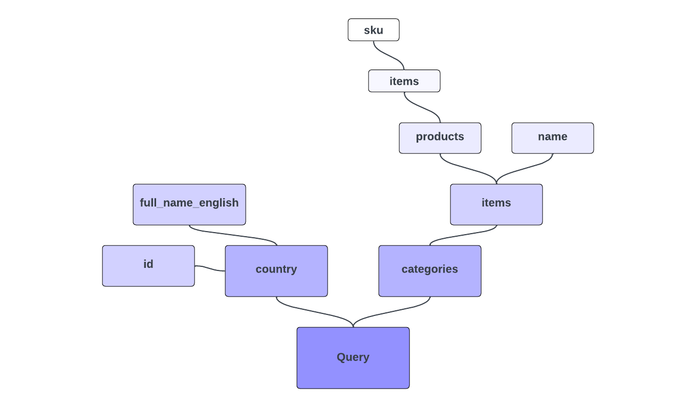

# GraphQLのクエリ

これは、GraphQLとAdobe Commerceのシリーズの第2部です。 このチュートリアルとビデオでは、GraphQL クエリについて説明し、Adobe Commerceに対してクエリを実行する方法を説明します。

>[!VIDEO](https://video.tv.adobe.com/v/3450059?captions=jpn&learn=on)

## このシリーズのGraphQLに関する関連動画とチュートリアル

* [第1部GraphQL – 概要](../graphql-rest/intro-graphql.md)
* [第3部GraphQL – 変異](../graphql-rest/graphql-mutations.md)
* [&#x200B; パート 4 GraphQL - スキーマ &#x200B;](../graphql-rest/graphql-schema.md)

## GraphQL構文の例

GraphQLのクエリ構文を、本格的な例で詳しく見てみましょう。 （https://venia.magento.com/graphqlに対してこれを自分で試すことができます）。

次のGraphQLクエリを確認します。

```graphql
{
    country (
        id: "US"
    ) {
        id
        full_name_english
    }

    categories(
        filters: {
            name: {
                match: "Tops"
            }
        }
    ) {
        items {
            name
            products(
                pageSize: 10,
                currentPage: 2
            ) {
                items {
                    sku
                }
            }
        }
    }
}
```

上記の問い合わせに対するGraphQL サーバーからの適切な応答は、次のようになります。

```json
{
  "data": {
    "country": {
      "id": "US",
      "full_name_english": "United States"
    },
    "categories": {
      "items": [
        {
          "name": "Tops",
          "products": {
            "items": [
              {
                "sku": "VSW06"
              },
              {
                "sku": "VT06"
              },
              {
                "sku": "VSW07"
              },
              {
                "sku": "VT07"
              },
              {
                "sku": "VSW08"
              },
              {
                "sku": "VT08"
              },
              {
                "sku": "VSW09"
              },
              {
                "sku": "VT09"
              },
              {
                "sku": "VSW10"
              },
              {
                "sku": "VT10"
              }
            ]
          }
        }
      ]
    }
  }
}
```

上記の例は、サーバーで定義された、Adobe Commerce用のすぐに使用できるGraphQL スキーマに依存しています。 このリクエストでは、お客様は
複数のタイプのデータを一度にクエリできます。 クエリは必要なフィールドを正確に表現し、返されるデータはフォーマットされます
クエリ自体と同じです。

>[!NOTE]
>
>GraphQL クライアントは、実際に送信されるHTTP リクエストの形式を難読化しますが、これは簡単に見つかります。 ブラウザーベースのクライアントを使用している場合は、クエリの送信時に「[!UICONTROL Network]」タブを確認します。 リクエストに「クエリ：`{string}`」で構成される生の本文が含まれていることがわかります。ここで、`{string}`はクエリ全体の生の文字列です。 リクエストがGETとして送信される場合、クエリは代わりにクエリ文字列パラメーター「query」にエンコードされる可能性があります。 RESTとは異なり、HTTP リクエストタイプは関係なく、クエリの内容のみが関係します。


## 欲しいものを探す

この例の`country`と`categories`は、2種類のデータに対する2つの異なる「クエリ」を表しています。 RESTのような従来のAPI パラダイムとは異なり、データタイプごとに個別および明示的なエンドポイントを定義します。 GraphQLでは、さまざまなタイプのデータを一度に取得できる式を使用して、単一のエンドポイントに柔軟にクエリできます。

同様に、クエリは、`country` （`id`と`full_name_english`）と`categories` （`items`）の両方に必要なフィールドを正確に指定し、それ自体にフィールドのサブセレクションがあります）、返されるデータはそのフィールドの指定を反映します。 これらのデータタイプで使用できるフィールドは、おそらく他にもたくさんあると思いますが、要求したものだけを返します。


>[!NOTE]
>
>`items`の戻り値が実際には値の&#x200B;_配列_&#x200B;であることに気付くかもしれませんが、それでもサブフィールドを直接選択しています。 フィールドのタイプがリストの場合、GraphQLは、リスト内の各項目に適用されるサブセレクションを暗黙的に理解します。

## 引数

返すフィールドは各タイプの中かっこ内で指定しますが、名前の付いた引数と値は、タイプ名の後の括弧内で指定します。 引数はオプションであることが多く、クエリの結果をフィルタリング、フォーマット、その他の方法で変換する方法にしばしば影響します。

`id`引数を`country`に渡し、クエリする特定の国を指定し、`filters`に`categories`引数を指定します。

## フィールドをダウンして

`country`と`categories`は別々のクエリやエンティティと考えがちですが、クエリで表現されるツリー全体は、実際にはフィールド以外で構成されていません。 `products`の式は、構文的に`categories`の式と同じです。 両方とも畑であり、その建設の間に違いはありません。

任意のGraphQL データグラフには、ツリーを開始する1つの「ルート」型（通常は`Query`と呼ばれます）があり、エンティティと見なされる型は、このルートのフィールドに割り当てられます。 このクエリの例では、実際にルートタイプに対して1つの汎用クエリを作成し、フィールド `country`と`categories`を選択しています。 その後、これらのフィールドのサブフィールドを選択し、いくつかのレベルの深い可能性があります。 フィールドの戻り値のタイプが複雑なタイプの場合（たとえば、スカラー型ではなく独自のフィールドを持つフィールドなど）は、目的のフィールドを引き続き選択します。

ネストされたフィールドのこの概念は、トップレベル `products` フィールドと同じように`pageSize` （`currentPage`および`categories`）の引数を渡すことができる理由でもあります。



## 変数

別のクエリを試してみましょう。

```graphql
query getProducts(
    $search: String
) {
    products(
        search: $search
    ) {
        items {
            ...productDetails
            related_products {
                ...productDetails
            }
        }
    }
}

fragment productDetails on ProductInterface {
    sku
    name
}
```

最初に注意すべきことは、クエリの開始ブレースの前にキーワード `query`を追加し、操作名（`getProducts`）を追加したことです。 この操作名は任意です。サーバースキーマ内の何にも対応しません。 この構文は、変数の導入をサポートするために追加されました。

前のクエリでは、フィールドの引数の値を文字列または整数として直接ハードコーディングしました。 ただし、GraphQL仕様では、変数を使用してユーザー入力をメインクエリから分離するためのファーストクラスのサポートがあります。

新しいクエリでは、クエリ全体の先頭の括弧の前に括弧を使用して`$search`変数を定義します（変数は常にドル記号のプレフィックス構文を使用します）。 この変数は、`search`の`products`引数に指定されています。

クエリに変数が含まれている場合、GraphQL リクエストには、クエリ自体と並行して、JSON エンコードされた個別の値ディクショナリが含まれていることが必要です。 上記のクエリでは、クエリ本文に加えて、次の変数値のJSONを送信できます。

```json
{
    "search": "VT01"
}
```

>[!NOTE]
>
>独自のAdobe Commerce インスタンスではなく、Venia サンプルサイトに対してこれらのクエリを試している場合、返される結果は`related_products`に対して空になる可能性があります。

テストに使用しているGraphQL対応クライアント（AltairやGraphiQLなど）では、UIはクエリとは別にJSON変数の入力をサポートしています。

GraphQL クエリの実際のHTTP リクエストの本文に「query: `{string}`」が含まれていることがわかったように、変数ディクショナリを含むリクエストには、同じ本文に追加の「variables: `{json}`」が含まれます。ここで、`{json}`は変数値を持つJSON文字列です。

新しいクエリでは、_フラグメント_ （`productDetails`）も使用して、同じフィールド選択を複数の場所で再利用します。 [&#x200B; フラグメント &#x200B;](https://graphql.org/learn/queries/#fragments){target="_blank"}の詳細については、GraphQL ドキュメントを参照してください。

{{$include /help/_includes/graphql-rest-related-links.md}}
